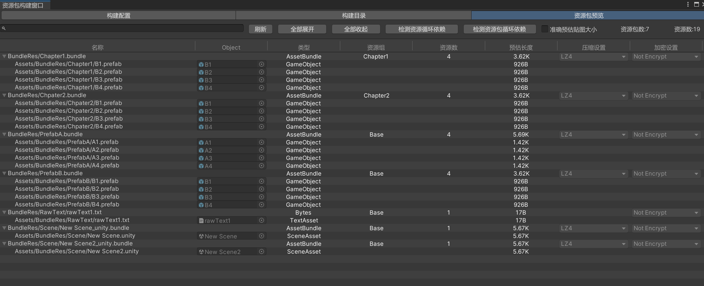
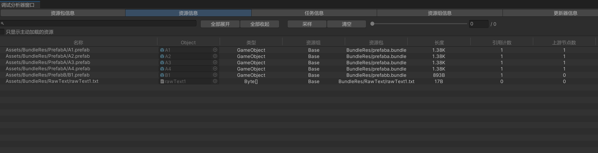

# 简介
Unity资源管理框架

提供了对AssetBundle及原生资源的构建、更新、加载、卸载的一站式资源管理

QQ交流群：762036315

# 功能介绍

- **基于资源目录与构建规则进行批量资源包构建，无需进行手动标记**

  

- **支持资源分组，并以资源组为单位进行资源更新**

  

- **资源包构建管线基于Unity最新的ScriptableBuildPipline所搭建，拥有比旧的内置构建管线更快的构建速度**

  *因此需要使用者自行在项目package manager中安装ScriptableBuildPipline包，否则会有缺失代码的编译报错*

  

- **支持仅构建发生了变化的资源及其相关资源，以大幅度提高资源包构建速度**

  *在资源包构建窗口勾选【构建补丁资源包】即可（第一次需要先进行完整资源包的构建以生成缓存文件）*

  

- **提供循环依赖分析与冗余资源分析**

  

- **支持基于资源目录的独立压缩设置与加密设置**

  

- **内置编辑器构建窗口与调试窗口（支持真机调试），可快速查看相关信息（点击上方工具栏CatAsset/打开资源包构建窗口或CatAsset/打开调试分析器窗口）**

  

  

  

- **支持3种类别的资源，并以同一套构建、更新、加载、卸载接口进行管理**

  1. 内置资源包资源（在Unity工程中使用CatAsset构建，从AssetBundle中加载的资源，如Prefab、Scene文件等）

  2. 内置原生资源（在Unity工程中使用CatAsset构建，不基于AssetBundle而是直接加载其二进制数据的资源，如DLL、Lua文件等）

  3. 外置原生资源（不使用CatAsset构建，直接从读写区加载其二进制数据的资源，如玩家自定义的图片、文本等）

     *内置资源支持从读写区导入，从而实现AssetBundle类型的Mod文件加载功能*

     

- **基于引用计数的资源加载与卸载，支持将资源的生命周期与游戏物体/场景的生命周期进行绑定，以实现半自动卸载**

  

- **精细的Asset级依赖管理，能将未使用的非Prefab及其依赖资源（如纹理、材质、音频等）及时卸载，而无须等到资源包卸载**

  *因此在资源包划分时可以无须过多关心其中非Prefab及其依赖资源的生命周期*

  *同时提供了快速的UnloadUnusedAssets实现，可以低耗时的将所有未使用的非Prefab及其依赖资源立即卸载*

  

- **支持自动寻址，使用者直接使用资源，无需关心资源最新版本的位置与资源包相关信息**

  

- **2种运行模式，Example文件夹中提供了2种模式的使用示例**

  1. 单机模式（仅使用安装包内资源）

  2. 可更新模式

     

- **支持边玩边下（即加载时若不存在本地则下载）**

  

- **支持编辑器资源模式，Unity编辑器下开启后无须进行资源包构建即可快速运行游戏**

  

- **自带并发限制，有效防止同时运行过多下载或加载导致的卡顿**

  

- **内置游戏对象池与引用池**

# 使用教程

[CatAsset使用教程](http://cathole.top/2022/08/30/catasset-guide/)

# 相关文章

[CatAsset开发总结：Editor篇](http://cathole.top/2022/09/01/catasset-dev-summary-with-editor/)

[CatAsset开发总结：Runtime篇](http://cathole.top/2022/09/04/catasset-dev-summary-with-runtime/)
